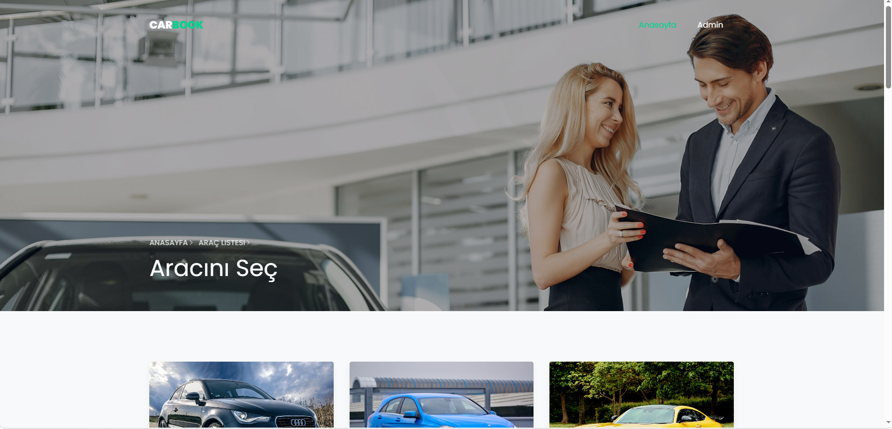
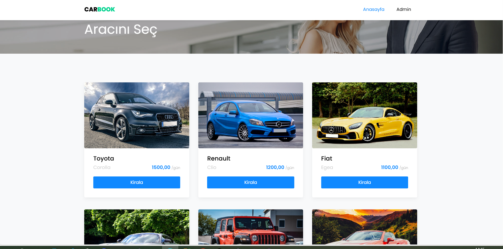
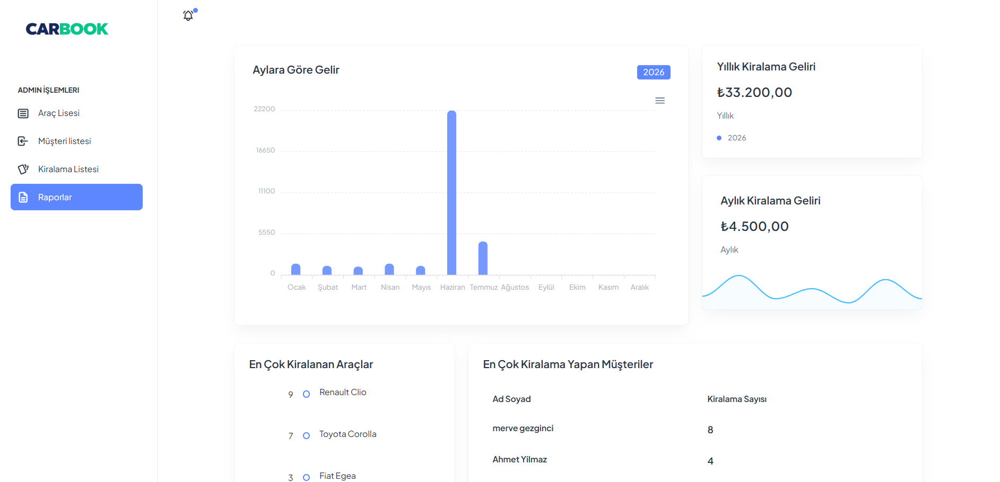
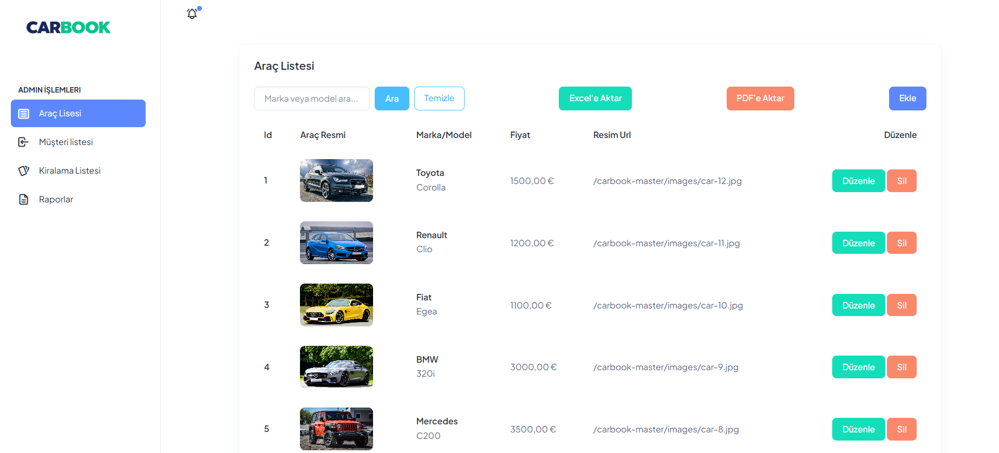
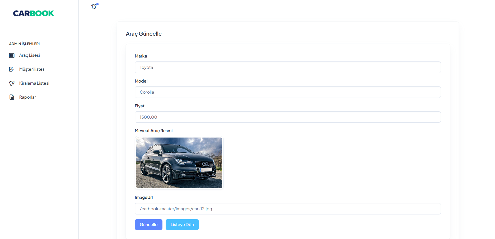
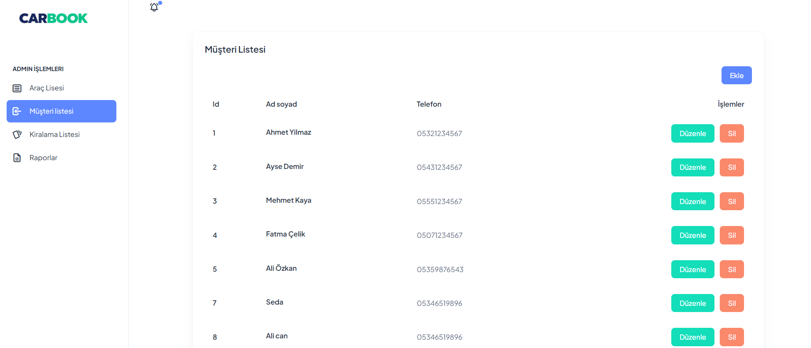
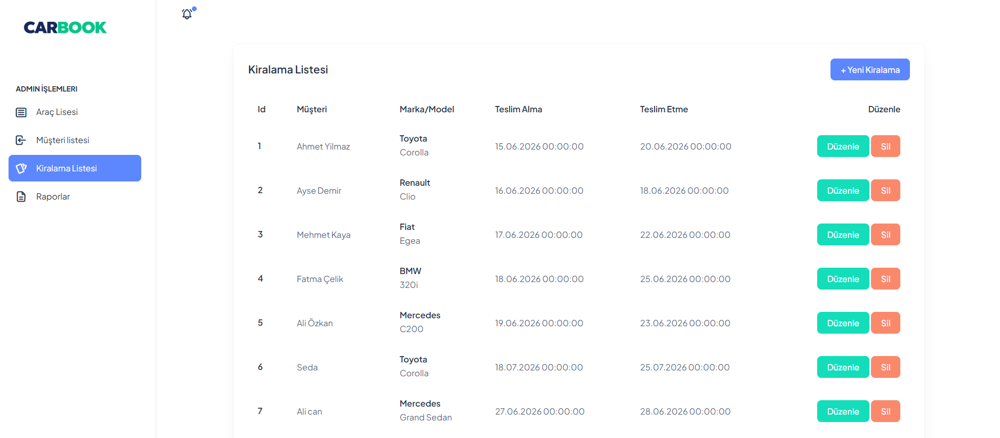

<!-- HEADER -->

<div align="center">

# 🚗 CarBook

### Modern Car Rental Management System with ASP.NET Core MVC & Entity Framework

A modern car rental management application built using ASP.NET Core MVC, Entity Framework, SQL Server and Bootstrap. The project includes vehicle management, customer management, rental operations, reporting features, PDF & Excel export capabilities.

---


</div>

---

# 📸 Project Screenshots

## Home Page



---

## Vehicle List



---

## Reporting



---

## Admin Vehicle List



---
## Edit Vehicle 



---


## Customer List



---

## Rental List



---


# 🚀 Project Features

### 🚘 Vehicle Management

- Vehicle Listing
- Add Vehicle
- Update Vehicle
- Delete Vehicle

---

### 👤 Customer Management

- Customer Listing
- Add Customer
- Update Customer
- Delete Customer

---

### 📋 Rental Management

- Create Rental
- Rental Listing
- Update Rental
- Delete Rental
- Vehicle Assignment
- Customer Assignment

---

### 📄 Reporting

- PDF Export
- Excel Export

---

# 🏗 Project Architecture

```text
CarBook

│

└── ASP.NET Core MVC

    ├── Entity Framework

    ├── Database First

    ├── SQL Server

    ├── Bootstrap 5

    ├── Razor Views

    ├── LINQ

    ├── QuestPDF

    └── EPPlus
```

---

# 🛠 Technologies

| Backend | Frontend | Database | Other |
|----------|----------|----------|--------|
| ASP.NET Core MVC | Bootstrap 5 | SQL Server | Entity Framework |
| C# | HTML5 | Database First | LINQ |
| Razor | CSS3 | Scaffold | QuestPDF |
| MVC Pattern | JavaScript | | EPPlus |
| CRUD Operations | Responsive Design | | |

---

# 📊 Modules

✔ Vehicle Management

✔ Customer Management

✔ Rental Management

✔ Database First Architecture

✔ Entity Framework

✔ LINQ Queries

✔ CRUD Operations

✔ PDF Report Export

✔ Excel Report Export

✔ Responsive Admin Panel

---

# 📂 Database Tables

| Table |
|---------|
| Cars |
| Customers |
| Rentals |

---

# 🎯 Learning Outcomes

- ASP.NET Core MVC
- Entity Framework
- Database First Approach
- SQL Server
- LINQ Queries
- CRUD Operations
- Bootstrap Dashboard
- PDF Report Generation
- Excel Report Generation
- Responsive Web Design

---

# ⭐ Project Status

✅ Completed

---

<div align="center">

Made with ❤️ using ASP.NET Core MVC

</div>
